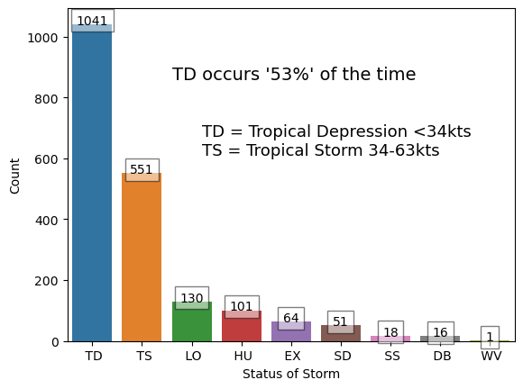
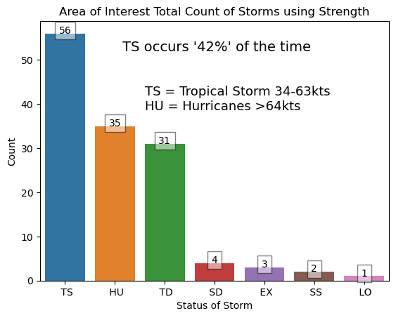

# Tropical Cyclone Prediction for Space Launch Delta 45 and Kennedy Space Center

## Overview

Provide analysis of tropical cyclone trends over time and prediction of future cyclone development. 

This analysis starts with an overall picture of total cyclones in the Atlantic and Gulf of Mexico.

Next, the analysis will focus in on the area of interest concerning SLD 45 and KSC.

Data used is from NOAA and NHC. The data range is from 1851 to 2023. 

I will provide a future probability of impact specifically to the Space Launch Delta 45 (SLD 45) and Kennedy Space Center (KSC).

Even more specifically I would like to predict the likelihood of tropical cyclones impact to the launch mission. 

## Research Questions and Project Goals

Provide a future probability of tropical cyclone impacts to our area of interest through 2050.

Provide a most likely/highest probability timeframe of tropical cyclone impacts based on historical data. 

Provide decision recommendations for leaders concerning tropical cyclone impacts. 
- Evacuations
- Asset protection
- Ground operations/safety procedures

If possible, are there any ways to maximize operations while tropical cyclones are in or around our area of interest?

Are there options to adjust launch weather constraints when under tropical cyclone influence?

## More Questions to Answer in the Data

- For this analysis how do we categorize impacts? Daily life, launch constraints, safety constraints. Not completed.
- Can we predict the likelihood of tropical storm impacts to the Space Coast specifically in the future? In progress.
- Is storm surge something we need to worry about? If so, what areas are most likely to be impacted? Not completed.

## Possible questions to explore
- Why has the trend in number of hurricanes been increasing? Might not be necessary for this audience.
- Should there be a concern for erosion caused by tropical storms. Could be beneficial.
- What can we do to mitigate impacts to the mission? Is there anything?
- Can trajectory of launch aid in mitigation?

## Key Points
- Without filters there are 1,973 unique tropical storms recorded in this dataset. 
- With the filter there are 132 that have impacted our area. 
- This means on average 6.7% of Tropical Cyclones will enter our AOI.

## Atlantic Basin for Overall Analysis
- This image represents the area considered the Atlantic Basin. The unfiltered data is tracking tropical cyclone development in this area. 

## Total Storms 

### This is a view of all tropical storms spanning from 1851 to 2023. The red line is a trend over time. I've extrapolated the trend line to 2050.

- We are seeing a clear upward trend in the amount of tropical cyclones on a yearly basis. 

- Note: much of the data before the 1900s is estimated and derived from historical observations. Overall, the data is considered reliable. 

- Outliers: we have seen 2 significantly higher seasons in the last 20 years, but this is not bad data. Over time we can see some years have more favorable conditions for tropical cyclone development. 

## Total Count of Tropical Cyclone Type over Time

### This chart shows that in most cases we are dealing with Tropical Depressions and Tropical Storms. Hurricanes are not as common in the bigger picture, but are far more deadly. 

- We are usually focused on hurricanes, but this tells us that maybe we should focus on the weaker storms. Tropical Storms and Depressions will be most likely to limit our mission.

## Area of Interest going forward

### The center point is Cape Canaveral with a 60mi radius. 

## Total Storms over Time and Future Projection

- Again this chart is specific to our AOI. 
- Note the amount of cyclones is much smaller due to narrow focus.
- The count of storms is not in whole numbers because it uses a 5 year mean.
- Still expecting an increasing amount of cyclones going forward. 

## Total Count of Tropical Cyclone Strength over Time

- Tropical storms are our most likely cyclone followed by hurricanes.
- Due to our location we are likely to see more developed storms... they have to be well developed to make it to our area. 

## Historical Average Amount of Cyclones per Month

- The main foucs here is to show when we need to worry. 
- Our area will see the most activity from August to October. 
- Coupled with thunderstorm season we can expect a higher likelihood of launch scrubs due to weather. 

## Historical Hurricane Tracks in Aug, Sept, and Oct

### August
- Cyclones predominantly coming from the south to SE. 

### September
- Most active month. 
- Start to see some cyclones coming from the west now.

### October
- Now we see most cyclones coming from the Gulf of Mexico.
- This is due to the Atlantic water temperatures starting to cool down. The Gulf of Mexico remains warm. 

### August and September are the worst months for storms that will have a greater impact on our area. 

### October is still a threat, but cyclone tracks shift significantly to coming from the west. This results in cyclones weakening over land before reaching our AOI. 

## Decision Recommendations for Hurricanes

- Want to create a decision matrix. 
- Hurricane track from East to South. Likely Aug-Sep
  - Greatest threat, evacuation recommended.
- Hurricane track from SSW to West. Likely Oct
  - Lower threat, evacuation not recommended.

## Storm Surge Threat

This is a difficult area for analysis. Data is sparse and modeling data is accomplished for worst case scenarios. I was able to come up with some estimations based on historical data. 

A tropical storm or weaker doesn't pose a big threat for storm surge. Rainfall could be an issue depending on the track. 

A hurricane coming from the west is not likely to have a huge impact via storm surge, but heavy rain is definitely a threat and would make it difficult to do any operations. Likely would not warrant an evacuation, but people would not be safe outdoors or traveling. 

A hurricane coming from the south to east or staying just off the coastline is the biggest threat for storm surge and overall impacts here. Any hurricane taking this path is dangerous for us. Best evacuation would be inland and not necessarily that far inland. 

## Launch Mission Weather Constraints

Any tropical cyclone in the AOI is most likely to violate at least 1 of the 10 weather rules. 

If we factor in user constraints we are likely at 0% chance of safe launch.

Is there a way to improve these odds at all? If rules were flexible at all then maybe. 

We can rule out any launch that requires recovery operations, unless boosters return to Cape Canaveral. 

Wind shear in the upper levels is highly likely, which will scrub a launch. 

Lightning is a little less likely with cyclones, but is still a threat especially in the outer bands. 

Question is if we launched through precip, cumulus clouds, and thick clouds would it trigger lightning. May need more research on this, but we could possibly identify times we were under cyclone influence and evaluate the electrical field using our field mills. 

Any hurricane can be considered no-go conditions in our AOI. Tropical storms or weaker could leave some flexibility. 

How about the groud operations? Do we need to stow the rocket? 

How about evacuations? Is it wise to evacuate? Look at evac routes and potential dangers with evacuating thousands of people at once. When would it be absolutely necessary to evacuate and where? What if the cyclone is coming from the west?

## Extra Thoughts 

Tropical cyclone development does have a correlation with La Nina patterns and AMO indicies, which is the water temps in the Atlantic near the equator. These two climate indices are relatively new for tracking patterns. Still, it has shown La Nina and warm atlantic waters are conducive to tropical cyclone development. 
https://www.cpc.ncep.noaa.gov/products/outlooks/hurricane.shtml

## What data sources will be used?
1. Using [Atlantic hurricane database](https://www.nhc.noaa.gov/data/) 1851-2023 
Local file in data/hurdat2_1851_2023.txt

This dataset (known as Atlantic HURDAT2) has a comma-delimited, text format with six-hourly information on the location, maximum winds, central pressure, and (beginning in 2004) size of all known tropical cyclones and subtropical cyclones.
HURDAT Reference
Landsea, C. W. and J. L. Franklin, 2013: Atlantic Hurricane Database Uncertainty and Presentation of a New Database Format. Mon. Wea. Rev., 141, 3576-3592.

This is a detailed description of [hurdat2](https://www.aoml.noaa.gov/hrd/hurdat/hurdat2-format.pdf)

2. GIS view of historical tracks
https://coast.noaa.gov/hurricanes/#map=7.17/28.131/-80.257&search=eyJzZWFyY2hTdHJpbmciOiJDYXBlIENhbmF2ZXJhbCwgQnJldmFyZCBDb3VudHksIEZsb3JpZGEsIDMyOTIwLCBVU0EiLCJzZWFyY2hUeXBlIjoiZ2VvY29kZWQiLCJvc21JRCI6IjEyMTY2MTAiLCJjYXRlZ29yaWVzIjpbIkg1IiwiSDQiLCJIMyIsIkgyIiwiSDEiLCJUUyIsIlREIiwiRVQiXSwieWVhcnMiOltdLCJtb250aHMiOltdLCJlbnNvIjpbXSwicHJlc3N1cmUiOnsicmFuZ2UiOlswLDEwMzBdLCJpbmNsdWRlVW5rbm93blByZXNzdXJlIjp0cnVlfSwiYnVmZmVyIjo2MCwiYnVmZmVyVW5pdCI6WyJOYXV0aWNhbCBNaWxlcyJdLCJzb3J0U2VsZWN0aW9uIjp7InZhbHVlIjoieWVhcnNfbmV3ZXN0IiwibGFiZWwiOiJZZWFyIChOZXdlc3QpIn0sImFwcGx5VG9BT0kiOnRydWUsImJhc2VtYXAiOiJzYXRlbGxpdGUiLCJpc1N0b3JtTGFiZWxzVmlzaWJsZSI6dHJ1ZX0=

This is the source of the raw data. https://coast.noaa.gov/digitalcoast/data/

## Notes

- Storm surge was difficult to explain due to lack of reliable data. 
- Tried breaking down the amount of storms per day/week in the months. Was not that helpful to the overall message. 
- 

## LEGEND
- TD - Tropical Cyclone <34kt intensity
- TS - Tropical Cyclone 34-63kt intensity
- HU - Hurricane >64kt intensity
- EX - Extratropical cyclone of any intensity
- SD - Subtropical cyclone <34kt intensity
- SS - Subtropical cyclone >34kt intensity
- LO - A low pressure system not tropical
- WV - Tropical wave of any intensity
- DB - Disturbance of any intensity